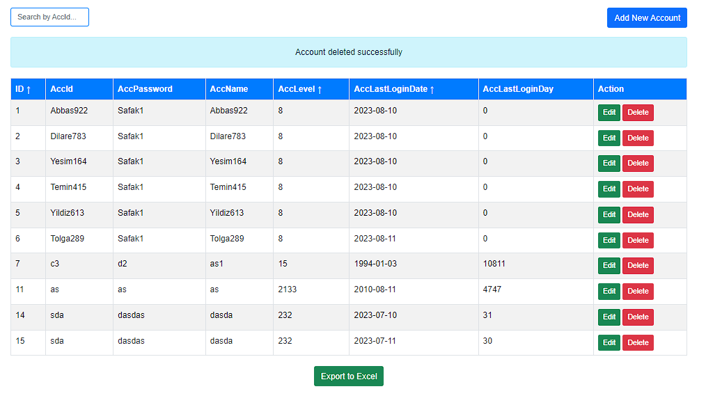

# Basit PHP CRUD Hesap Yönetim Uygulaması

Bu proje, hesapları yönetmek için oluşturulmuş basit bir PHP CRUD (Create, Read, Update, Delete) uygulamasıdır. Kullanıcılar, hesapları ekleyebilir, düzenleyebilir, silebilir ve arayabilir. Ayrıca hesapları sütunlara göre sıralayabilir ve verileri Excel dosyasına dışa aktarabilir.

## Teknolojiler ve Araçlar

- HTML ve CSS: Kullanıcı arayüzünü oluşturmak ve stil vermek için HTML ve CSS kullanıldı.
- Bootstrap: Tema ve stil bileşenleri için Bootstrap çerçevesi kullanıldı.
- PHP: Sunucu tarafında işlemler için PHP programlama dili kullanıldı.
- MySQL: Veritabanı yönetimi için MySQL kullanıldı.
- jQuery: Arayüz etkileşimleri ve dinamik özellikler için jQuery kütüphanesi kullanıldı.



## Özellikler

- Hesap Ekleme: Yeni hesapları sisteme ekleyebilirsiniz.
- Hesap Düzenleme: Mevcut hesap bilgilerini düzenleyebilirsiniz.
- Hesap Silme: Hesapları sistemden silebilirsiniz.
- Hesap Arama: Hesapları ID'ye göre arayabilirsiniz.
- Sıralama: Hesapları farklı sütunlara göre sıralayabilirsiniz.
- Excel'e Veri Aktarma: Hesap verilerini Excel dosyasına dışa aktarabilirsiniz.

## Nasıl Kullanılır

1. Proje dosyalarını indirin veya kopyalayın.
2. Veritabanı ayarlarınızı `connection.php` dosyasında yapılandırın.
3. `index.php` dosyasını web sunucusunda çalıştırın.

## SQL Örnek Veriler

Proje veritabanınızda yer alacak birkaç örnek hesap verisi:

```sql
-- tabloAdi tablosu için örnek veriler ekleme
INSERT INTO tabloAdi (accountsId, accountsPassword, accountsName, accountsLevel, accountsLastLogin)
VALUES
    ('user123', 'pass123', 'Player 1', 30, '2023-07-15'),
    ('user456', 'pass456', 'Player 2', 25, '2023-07-12'),
    ('user789', 'pass789', 'Player 3', 18, '2023-07-10'),
    ('user321', 'pass321', 'Player 4', 40, '2023-07-08');
